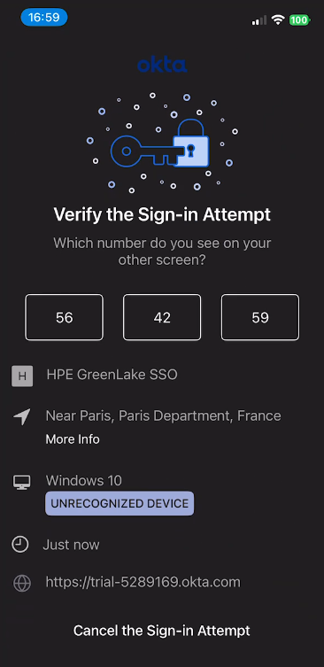
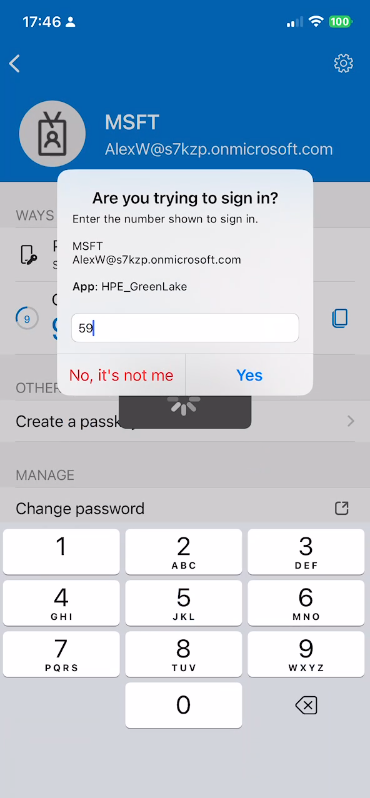

# HPE Compute Ops Management PowerShell Library 

The HPE Compute Ops Management PowerShell library (`HPECOMCmdlets`) offers a comprehensive suite of cmdlets designed to manage and automate your HPE GreenLake environment. By leveraging this library, users can seamlessly interact with HPE GreenLake and Compute Ops Management services directly from the PowerShell command line, enabling efficient integration into existing automation workflows and enhancing operational efficiency.

This library is actively maintained with continuous updates to support new HPE GreenLake features as they are released.

## Latest Release

| Version | Downloads | Status | PowerShell |
|---------|-----------|--------|------------|
| 1.0.19 | [![PS Gallery][GL-master-psgallery-badge]][GL-master-psgallery-link] | [](https://github.com/jullienl/HPE-COM-PowerShell-Library) | [](https://github.com/PowerShell/PowerShell) |


## Table of Contents
- [Documentation & Tutorials](#documentation--tutorials)
- [Quick Start](#quick-start)
- [Requirements](#requirements)
- [Best Practices & Performance Considerations](#best-practices--performance-considerations)
- [Supported Authentication Methods](#supported-authentication-methods)
  - [Single-factor authentication with HPE Account](#single-factor-authentication-with-hpe-account)
  - [Multi-factor authentication (MFA) with HPE Account](#multi-factor-authentication-mfa-with-hpe-account)
  - [SAML Single Sign-On (SSO) with passwordless authentication](#saml-single-sign-on-sso-with-passwordless-authentication)
- [Installation](#how-to-install-the-module)
- [Upgrade](#how-to-upgrade-the-module)
- [How to Connect to HPE GreenLake and Compute Ops Management](#how-to-connect-to-hpe-greenlake-and-compute-ops-management)
- [Support](#support)
- [Troubleshooting](#common-issues-and-solutions)
- [Disclaimer](#disclaimer)
- [Additional Resources](#want-more)
- [License](#license)


## Documentation & Tutorials

**📘 Blog & Guides**: For detailed insights, step-by-step tutorials, and the latest updates, visit:
- ✨ **[PowerShell Library for HPE Compute Ops Management](https://jullienl.github.io/PowerShell-library-for-HPE-GreenLake)** - Main blog with examples and best practices
- 🎯 **[Configuring SAML SSO with HPE GreenLake and Passwordless Authentication](https://jullienl.github.io/Configuring-SAML-SSO-with-HPE-GreenLake-and-Passwordless-Authentication-for-HPECOMCmdlets)** - Complete setup guide for integrating Okta, Microsoft Entra ID, and PingIdentity with HPE GreenLake using passwordless authentication methods for this PowerShell module

---

## Quick Start

Get up and running in 3 steps:

1. **Install the module**
    ```powershell
    Install-Module HPECOMCmdlets
    ```

2. **Connect with your credentials**
    ```powershell
    # Connect with SSO (Okta, Entra ID, PingID)
    Connect-HPEGL -SSOEmail "user@company.com" -Workspace "MyWorkspace"

    # Connect with HPE Account
    Connect-HPEGL -Credential (Get-Credential) -Workspace "MyWorkspace"
    ```

3. **Start managing resources**
    ```powershell
      # List all devices in workspace
      Get-HPEGLDevice

      # Get servers from specific COM region
      Get-HPECOMServer -Region "eu-central"

      # Add multiple tags to devices
      Get-HPEGLDevice | Add-HPEGLDeviceTagToDevice -Tags "Environment=Production, Location=DataCenter1"

      # View subscriptions
      Get-HPEGLSubscription

      # Create a new workspace
      New-HPEGLWorkspace -Name "Development" -Type 'Standard enterprise workspace' -Street "123 Main St" -Country "United States"

      # Invite users with specific roles
      Send-HPEGLUserInvitation -Email "admin@company.com" -Role 'Workspace Administrator'

      # Monitor and manage server jobs
      Get-HPECOMJob -Region "eu-central"
      Restart-HPECOMServer -Region "eu-central" -ServerSerialNumber 'CZ12312312' -ScheduleTime (Get-Date).AddHours(6)

      # Browse available firmware bundles
      Get-HPECOMFirmwareBaseline -Region "eu-central"

      # Organize servers into groups
      Get-HPECOMGroup -Region "us-west"
      New-HPECOMGroup -Region "us-west" -Name "Production-Servers"
      Add-HPECOMServerToGroup -Region "us-west" -ServerSerialNumber "J208PP0026" -GroupName "Production-Servers"
      ```

      📦 **More Examples**: Explore the [Zero Touch Automation](https://github.com/jullienl/HPE-COM-PowerShell-Library/blob/main/Examples/Zero_Touch_Automation.ps1) script for comprehensive command reference.


4. **Disconnect when done**
    ```powershell
    Disconnect-HPEGL
    ```

### Troubleshooting & Help
```powershell
# Get detailed help for any cmdlet
Get-Help Connect-HPEGL -Full
Get-Help Set-HPEGLSSOConnection -Examples

# Enable verbose output for debugging
Connect-HPEGL -SSOEmail "user@company.com" -Workspace "Production" -Verbose

# List all available cmdlets
Get-Command -Module HPECOMCmdlets
```

> 💡 **Need More Help?** Check out the [blog tutorials](https://jullienl.github.io/PowerShell-library-for-HPE-GreenLake) for detailed walkthroughs and real-world examples!


## Requirements

- **Supported PowerShell Version**: 7 or higher. 

    > **Note**: PowerShell version 5 is no longer supported. 

- **Supported PowerShell Editions**: PowerShell Core version 7 or higher.

- **HPE Account requirements**: Required for direct authentication (username/password or MFA)

  ✅ **When you need it:**
  - Authenticating directly to HPE GreenLake without SSO
  - Using built-in MFA (email or authenticator app)

  ❌ **When you don't need it:**
  - Using SSO with Okta, Microsoft Entra ID, or PingIdentity
  - Your organization manages authentication through external IdP

  📝 **Create your account:**
  - Visit: https://common.cloud.hpe.com
  - Setup guide: [HPE GreenLake Cloud User Guide](https://support.hpe.com/hpesc/public/docDisplay?docId=a00120892en_us&page=GUID-497192AA-FDC2-49C5-B572-0D2F58A23745.html)


- **Roles and permissions:**
  Minimum required role to connect and view resources:
  - HPE GreenLake Workspace Observer (view-only access)
  - HPE Compute Ops Management Viewer (view-only access for each COM instance)

  Additional roles required for management operations:
  - HPE GreenLake Workspace Administrator: Required for workspace creation and management
  - HPE Compute Ops Management Administrator: Required for COM instance provisioning and management

  Note: Multiple roles can be assigned to a single user. Contact your HPE GreenLake administrator to request appropriate role assignments.


- **Workspace Type Compatibility**:

  - **Enhanced workspaces (IAMv2):** Fully supported since v1.0.19 
    - ✅ Complete feature set including new organization management, user groups, and scope-based access control (SBAC)
    - ✅ Advanced identity features: domains, SSO connections, authentication policies
    - ✅ Modern user and role management with improved security
    - ✅ All new features and functionality
    
  - **Legacy workspaces (IAMv1):** Continued support with compatibility mode
    - ✅ Core functionality remains fully operational
    - ⚠️ Some SAML SSO domain functions are deprecated (migration guidance provided)
    - ⚠️ Limited access to newer IAMv2-specific features (user groups, advanced SBAC, etc.)
    - 📖 See [Migration Guide](Build-Tools/Release%20notes/1.0.19.md#migration-guide) in release notes for updating deprecated functions 

## Best Practices & Performance Considerations

### API Rate Limiting

HPE GreenLake APIs implement rate limiting to ensure fair resource allocation and system stability. While most users won't encounter these limits during normal operations, it's important to be aware of them for high-volume scenarios.

**When Rate Limits May Apply:**
- **Bulk Operations**: Processing hundreds or thousands of resources in rapid succession
- **Parallel Execution**: Running multiple scripts or PowerShell sessions simultaneously
- **High-Frequency Automation**: Scheduled tasks running every few minutes
- **Large-Scale Inventory**: Retrieving detailed information for many servers at once

**Best Practices to Avoid Rate Limiting:**

1. **Batch Your Operations**:
   ```powershell
   # Instead of individual calls in a tight loop
   $servers = Get-HPECOMServer -Region "eu-central"
   # Then process results without additional API calls
   $servers | Where-Object { $_.Model -like "*DL380*" }
   ```

2. **Add Delays for Bulk Operations**:
   ```powershell
   # For large-scale operations, add a small delay
   Get-HPECOMServer -Region "eu-central" | ForEach-Object {
       Get-HPECOMServerInventory -Region "eu-central" -Name $_.SerialNumber
       Start-Sleep -Milliseconds 100  # Small delay between calls
   }
   ```

3. **Use Filtering Parameters**: Reduce API calls by using cmdlet parameters instead of PowerShell filtering
   ```powershell
   # Good: Server-side filtering
   Get-HPECOMServer -Region "eu-central" -Model "ProLiant DL380 Gen10"
   
   # Less efficient: Client-side filtering (more API calls)
   Get-HPECOMServer -Region "eu-central" | Where-Object { $_.Model -eq "ProLiant DL380 Gen10" }
   ```

4. **Schedule Automation Wisely**: For scheduled scripts, avoid intervals shorter than 5-10 minutes unless necessary

**If You Encounter Rate Limiting:**
- Error: `429 (Too Many Requests)` or `Rate limit exceeded`
- Solution: Wait a few minutes before retrying, or implement exponential backoff in your scripts
- The library includes automatic retry logic for some transient errors

> **Note**: Rate limits vary by API endpoint and are subject to change. For specific limits, consult the [Rate limiting](https://developer.greenlake.hpe.com/docs/greenlake/guides/public/rate-limiting/rate-limiting) page on the HPE GreenLake Developer Portal.

## Supported authentication methods

### Single-factor authentication with HPE Account
  - Requires an HPE Account (username and password)
  - Direct authentication using HPE Account credentials
  - Suitable for non-SSO environments or testing scenarios

### Multi-factor authentication (MFA) with HPE Account
  - **Supported MFA Methods**:
    - Time-based One-Time Password (TOTP) codes via Google Authenticator
    - Push notifications via Okta Verify mobile app
    
    > **Note**: FIDO2 security keys and biometric authenticators (Windows Hello, Touch ID) are not supported      

  - **MFA Requirements**:
    - An HPE account with MFA configured
    - Authenticator app must be installed and linked to your HPE Account
    - If your account uses only security keys or biometrics, you must enable Google Authenticator or Okta Verify in your account settings
    - When both methods are available, Okta Verify push notifications take precedence

### SAML Single Sign-On (SSO) with passwordless authentication 
        
  - **Supported Identity Providers**:

    | Identity Provider      | Implementation     | Status             | Push Notifications | TOTP Codes | Number Matching | Timeout | Cloud Environment             | Requirements | Last Tested |
    | ---------------------- | ------------------ | ------------------ | ------------------ | ---------- | --------------- | ------- | ----------------------------- | ------------ | ----------- |
    | **Okta (OIE only)**    | Okta SAML + Okta Verify | ✅ Fully Supported | ✅ Yes             | ✅ Yes     | Optional        | 2 min   | All Okta regions             | **Requires OIE**<br>❌ Classic not supported | Dec-2025  |
    | **Microsoft Entra ID** | Entra ID SAML + Microsoft Authenticator | ✅ Fully Supported | ✅ Yes             | ❌ No      | Mandatory       | 2 min   | Commercial cloud only        | — | Nov-2025  |
    | **PingIdentity**       | PingOne SAML + PingID MFA | ✅ Fully Supported | ✅ Yes             | ✅ Yes     | Optional        | 2 min   | All PingOne regions          | — | Nov-2025  |
    | **PingIdentity**       | PingFederate SAML + PingID MFA | ⚠️ Not Tested | ✅ Expected     | ✅ Expected | Optional        | 2 min   | All PingOne regions          | — | Nov-2025  |


      > ⚠️ **Important: Testing & Environment Variations**
      >
      > While this library has been tested with **Okta**, **Microsoft Entra ID**, and **PingIdentity** in standard configurations, Identity Provider implementations can vary significantly across organizations due to:
      > - Custom authentication policies and security settings
      > - Regional differences and cloud environments
      > - Organization-specific configurations and restrictions
      > - Version differences in IdP software
      >
      > If you encounter authentication issues specific to your environment:
      > - 🐛 **Report Bugs**: [Open an issue](https://github.com/jullienl/HPE-COM-PowerShell-Library/issues)
      > - 💬 **Get Help**: [GitHub Discussions](https://github.com/jullienl/HPE-COM-PowerShell-Library/discussions)
      > - 📘 **Check Guide**: [SAML SSO Configuration Tutorial](https://jullienl.github.io/Configuring-SAML-SSO-with-HPE-GreenLake-and-Passwordless-Authentication-for-HPECOMCmdlets)

 
  - **⚠️ Unsupported Identity Providers**
    - Identity Providers **not listed in the table above** (such as Google Workspace, Salesforce Identity, IBM Security Verify, Auth0, OneLogin, etc.) are **not supported** by this library.
    - **Why?** While these providers may support SAML 2.0, their authentication flows differ significantly and have not been tested or implemented in this library.
  
    - **Alternative Authentication Options:**
      1. **HPE Account**: Use direct authentication with or without MFA with Google Authenticator or Okta Verify

         ```powershell
         Connect-HPEGL -Credential (Get-Credential) -Workspace "Production"
         ```

      2. **Request Support**: [Open a feature request](https://github.com/jullienl/HPE-COM-PowerShell-Library/issues) with:
          - Your Identity Provider name and version
          - Authentication methods your organization uses
          - Your specific use case and requirements

  - **Passwordless Authentication**:
    - This library implements passwordless authentication in accordance with industry security best practices recommended by Microsoft, NIST, and FIDO Alliance
    - Uses cryptographic keys and biometric verification to eliminate password-related vulnerabilities including phishing, credential stuffing, and brute force attacks
    - Provides enhanced security while improving user experience by removing password management overhead
    - **SSO password authentication is not supported** - when using SAML SSO (Okta, Entra ID, PingIdentity), only passwordless methods (push notifications and TOTP) are supported to ensure the highest security level
    - **HPE Account password authentication remains supported** - direct authentication using HPE Account credentials (username/password) continues to work for non-SSO scenarios

  - **Authentication Method Support**:

    - ✅ **Supported**: Push notifications (Microsoft Authenticator, Okta Verify, PingID) and TOTP codes
    - ❌ **Not Supported**: FIDO2 security keys, passkeys, and Windows Hello biometrics
    
      > **Recommendation**: If your account is configured only for FIDO2/passkey authentication, enable push notifications in your Identity Provider settings for PowerShell access. Push notifications with number matching meet the same phishing-resistant security standards as FIDO2

      > **Technical Reason**: FIDO2/WebAuthn requires browser-native APIs (navigator.credentials) and direct hardware access that are not available in PowerShell automation environments 

  - **SSO Prerequisites**:
    - ✅ SAML SSO configured in your HPE GreenLake workspace
    - ✅ Identity Provider configured with HPE GreenLake as a SAML 2.0 application
    - ✅ Passwordless authentication methods enabled (push notifications and/or TOTP)
    - ✅ User has appropriate application access permissions
    - ✅ Domain pre-claimed in workspace (use `Get-HPEGLDomain` to verify, `Get-HPEGLSSOConnection` to check configuration)

  - **Quick Setup with PowerShell**: Automate SAML SSO configuration using these cmdlets to manage domains, connections, and authentication policies in your workspace:

    **Initial Configuration (4 Steps):**
    1. **`New-HPEGLDomain`** - Claim your organization's domain in HPE GreenLake
    2. **`Test-HPEGLDomain`** - Verify domain ownership via DNS TXT record validation
    3. **`New-HPEGLSSOConnection`** - Configure SAML SSO connection to your Identity Provider (Okta, Entra ID, or PingIdentity)
    4. **`New-HPEGLSSOAuthenticationPolicy`** - Apply SSO authentication policy to your workspace

    **Management & Monitoring:**
    - **View Configuration:**
      - `Get-HPEGLDomain` - List workspace domains and ownership status
      - `Get-HPEGLSSOConnection` - Display SSO connection details and metadata
      - `Get-HPEGLSSOAuthenticationPolicy` - Review active authentication policies
    
    - **Update Configuration:**
      - `Set-HPEGLSSOConnection` - Modify SSO connection (certificates, SAML attributes, session timeouts)
      - `Set-HPEGLSSOAuthenticationPolicy` - Update authentication policy settings
    
    - **Remove Configuration:**
      - `Remove-HPEGLDomain` - Delete a domain from workspace
      - `Remove-HPEGLSSOConnection` - Remove SSO connection
      - `Remove-HPEGLSSOAuthenticationPolicy` - Delete authentication policy

    > 💡 **Tip**: Use `Get-Help <cmdlet-name> -Examples` to see practical usage scenarios for each cmdlet.

  - **Configuration Guide**:  

    > 📘 **[Complete SAML SSO Setup Guide](https://jullienl.github.io/Configuring-SAML-SSO-with-HPE-GreenLake-and-Passwordless-Authentication-for-HPECOMCmdlets)**  
    > Step-by-step tutorial covering Okta, Microsoft Entra ID, and PingIdentity configuration with passwordless authentication integration. Includes screenshots, troubleshooting tips, and best practices.

    Additional Resources:
      - 📖 [HPE GreenLake Cloud User Guide](https://support.hpe.com/hpesc/public/docDisplay?docId=a00120892en_us) - Official HPE documentation for workspace and authentication configuration
      - 💬 [GitHub Discussions](https://github.com/jullienl/HPE-COM-PowerShell-Library/discussions) - Community support and Q&A

  - **⚠️ Okta Identity Engine (OIE) Requirement**
    
    > **IMPORTANT**: This library **requires Okta Identity Engine (OIE)** for Okta SSO authentication. **Okta Classic Engine is not supported**.
    
    **Why OIE is Required:**
    - Okta Classic Engine's authentication API (`/api/v1/authn`) requires password-based authentication
    - This library implements passwordless authentication using the IDX API (`/idp/idx/*`), which is only available in OIE
    - Classic Engine cannot support the passwordless MFA flows required by this module
    
    **How to Check Your Okta Environment:**
    - Log into your Okta Admin Console
    - Navigate to any page within the Admin Console, such as the **Dashboard**.
    - Scroll to the bottom of the page and look at the footer section. You'll see a version number displayed there (e.g., something like "2025.12.0")    
    - Check the suffix of that version number:
       - If it ends with **E** (e.g., 2025.12.0**E**), your org is running on the **Okta Identity Engine (OIE)**.
       - If it ends with **C** (e.g., 2025.12.0**C**), your org is running on the **Classic Engine**.
    
         
    
    **How to Upgrade to OIE:**
    - Contact your Okta administrator or Okta support
    
    **Additional Resources:**
    - 📖 [Okta Identity Engine Overview](https://support.okta.com/help/s/product-hub/oie/overview?language=en_US) - Official Okta documentation


## How to Install the Module  

To install the library, use the following command to download and install the module from the official PowerShell Gallery:

```powershell
# Check PowerShell version
$PSVersionTable.PSVersion  # Should be 7.0 or higher

# Install the module
Install-Module HPECOMCmdlets

# Verify installation
Get-Module HPECOMCmdlets -ListAvailable

# View available cmdlets
Get-Command -Module HPECOMCmdlets
```

##  How to Upgrade the Module 

If you have already installed the module and need to update it to the latest version, run the following commands:

```powershell
# Step 0: Unload the module from memory (if currently loaded)
Remove-Module HPECOMCmdlets -Force -ErrorAction SilentlyContinue

# Step 1: Get the currently installed version
$latestVersion = (Get-InstalledModule HPECOMCmdlets | Sort-Object Version -Descending | Select-Object -First 1).Version

# Step 2: Install latest version
Install-Module -Name HPECOMCmdlets -Scope CurrentUser -Force -AllowClobber

# Step 3: Uninstall the old version
Uninstall-Module -Name "HPECOMCmdlets" -RequiredVersion $latestVersion

# Step 4: Verify the upgrade
Get-Module HPECOMCmdlets -ListAvailable | Select-Object Name, Version, Path
```
<br>

  > **Important Notes:**
  > - **Step 0 (Unload Module)**: Required to release file locks and clear old code from memory. Without this, Windows may prevent file updates or the old version may remain active even after installation.
  > - **-Scope CurrentUser**: Installs to your user profile (`~\Documents\PowerShell\Modules\`) without requiring administrator privileges. Omit this parameter or use `-Scope AllUsers` if you have admin rights and want to install for all users.
  > - **Version Verification**: Step 4 confirms the upgrade succeeded and shows the installation path to verify the correct version is loaded.

## How to Connect to HPE GreenLake and Compute Ops Management

The `Connect-HPEGL` cmdlet establishes a connection to HPE GreenLake and its associated Compute Ops Management (COM) services. This connection enables you to manage resources across your HPE GreenLake workspace and all configured COM instances.

### Connection Scope

- **Single Connection**: One active connection per PowerShell session via `$Global:HPEGreenLakeSession`
- **Multi-Region COM Access**: Automatically connects to all COM instances in your workspace (e.g., eu-central, us-west, ap-northeast)
- **Service Coverage**: Provides access to the HPE GreenLake platform service and all regional COM instances simultaneously

### Session Management

The `Connect-HPEGL` cmdlet creates a persistent session stored in `$Global:HPEGreenLakeSession`, which contains:

- **Session Information**: Web request sessions for authentication and API operations
- **API Credentials**: Temporary unified API client credentials for HPE GreenLake and Compute Ops Management instances
- **OAuth2 Tokens**: Access tokens, ID tokens, and refresh tokens with automatic refresh capabilities
- **Workspace Details**: Workspace ID, name, and organization information
- **Token Metadata**: Creation timestamps and expiration details

**Token Lifecycle:**
- **Access Tokens**: Valid for 2 hours with automatic refresh when they expire
- **Refresh Tokens**: Used to obtain new access tokens without re-authentication
- **Session Persistence**: Does not persist across PowerShell restarts
- **Manual Disconnect**: Use `Disconnect-HPEGL` to clear the session and invalidate tokens

**View Session Details:**
```powershell
# Display current session information
$Global:HPEGreenLakeSession

# View API credentials for connected services
$Global:HPEGreenLakeSession.apiCredentials

# Check token expiration time
$Global:HPEGreenLakeSession.oauth2TokenCreation
```

> **💡 Tip**: For detailed session properties and structure, use `Get-Help Connect-HPEGL -Full` and review the OUTPUTS section.

### Regional COM Instance Support

When connected, you can target specific COM instances using the `-Region` parameter in COM-related cmdlets:

```powershell
# Manage servers in European COM instance
Get-HPECOMServer -Region "eu-central"

# Manage servers in US COM instance  
Get-HPECOMServer -Region "us-west"
```

### Authentication Examples

### Example 1: Direct authentication with username and password

- Bypasses SSO federation and requires an HPE account

  ```powershell
  $cred = Get-Credential
  Connect-HPEGL -Credential $cred -Workspace "Production" -RemoveExistingCredentials
  ```

- The `-RemoveExistingCredentials` parameter removes all existing API credentials generated by previous connections. Use this to resolve the "maximum of 7 personal API clients" error by clearing unused credentials.

- Upon successful connection, a `$Global:HPEGreenLakeSession` object is created and displayed, containing your authentication context and connection details

  


### Example 2: SAML SSO with Okta (push notification with number matching)

- Uses Okta SAML federation with Okta Verify push notifications
- Number matching provides phishing-resistant authentication

  ```powershell
  Connect-HPEGL -SSOEmail "user@company.com" -Workspace "Production"
  ```

   > **💡 Tip**: Add `-RemoveExistingCredentials` if you encounter "maximum of 7 personal API clients" error. This clears old API credentials from previous sessions.
  
- During the authentication process, a verification number (e.g., 59) will be displayed in the PowerShell console

     

- Approve the push notification sent to Okta Verify by tapping the matching number on your mobile device.

  


### Example 3: SAML SSO with Microsoft Entra ID (push notification with number matching)
- Uses Microsoft Entra ID SAML federation with Microsoft Authenticator
- Number matching is mandatory and provides phishing-resistant authentication

  ```powershell
  Connect-HPEGL -SSOEmail "user@company.com" -Workspace "Production"
  ```

   > **💡 Tip**: Add `-RemoveExistingCredentials` if you encounter "maximum of 7 personal API clients" error. This clears old API credentials from previous sessions.

- During the authentication process, a verification number (e.g., 59) will be displayed in the PowerShell console

  

- Approve the push notification sent to Microsoft Authenticator by typing the matching number on your mobile device. 

  


### Example 4: SAML SSO with PingIdentity (push notification)
- Uses PingIdentity SAML federation with PingID mobile app
- Supports both push notifications and TOTP codes for flexible authentication

  ```powershell
  Connect-HPEGL -SSOEmail "user@company.com" -Workspace "Production"
  ```

   > **💡 Tip**: Add `-RemoveExistingCredentials` if you encounter "maximum of 7 personal API clients" error. This clears old API credentials from previous sessions.

- During the authentication process, a push notification will be sent to your PingID mobile app

  

- Approve the push notification on your mobile device to complete authentication

  


### Example 5: Connect without specifying workspace 

- If you have not yet created any workspace, you must omit the `-Workspace` parameter. 

  ```powershell
  Connect-HPEGL -SSOEmail "user@company.com"
  ```

- After successful authentication, you can create a new workspace using `New-HPEGLWorkspace`.


### Example 6: Enable verbose output for troubleshooting

- Use the `-Verbose` parameter to display detailed authentication flow information for debugging connection issues

  ```powershell
  Connect-HPEGL -SSOEmail "user@company.com" -Workspace "Production" -Verbose
  ```

- The verbose output includes:
  - SAML authentication steps and redirects
  - Identity Provider detection and configuration
  - MFA method selection and status
  - API token generation and validation
  - Workspace connection confirmation

- Useful for diagnosing authentication failures, SSO configuration issues, or timeout problems

---

### Connecting to Development/Staging Environments (Optional)

> **Note**: This section is for HPE internal developers and partners who need to test against HPE GreenLake development, staging, or pre-production environments.

By default, `Connect-HPEGL` connects to the production HPE GreenLake environment. If you need to connect to a development or staging environment, you can override the default API endpoints using environment variables.

**Environment Variables for Custom Endpoints:**

| Variable | Description | Production Default |
|----------|-------------|-------------------|
| `HPE_COMMON_CLOUD_URL` | HPE GreenLake Common Cloud API endpoint | `https://common.cloud.hpe.com` |
| `HPE_AUTH_URL` | HPE Authentication/Authorization endpoint | `https://auth.hpe.com` |
| `HPE_SSO_URL` | HPE SSO endpoint for SAML federation | `https://sso.common.cloud.hpe.com` |

**Example: Connect to Development Environment**

```powershell
# Set environment variables for development endpoints
$env:HPE_COMMON_CLOUD_URL = "https://pavo.common.cloud.hpe.com/"
$env:HPE_AUTH_URL = "https://auth-itg.hpe.com"
$env:HPE_SSO_URL = "https://dev-sso.common.cloud.hpe.com"

# Connect using SSO (environment variables are automatically detected)
Connect-HPEGL -SSOEmail "user@company.com" -Workspace "TestWorkspace"

# Or connect with credentials
Connect-HPEGL -Credential (Get-Credential) -Workspace "TestWorkspace"
```

**Example: Connect to Staging Environment**

```powershell
# Set environment variables for staging endpoints
$env:HPE_COMMON_CLOUD_URL = "https://staging-common.cloud.hpe.com"
$env:HPE_AUTH_URL = "https://staging-auth.hpe.com"
$env:HPE_SSO_URL = "https://staging-sso.common.cloud.hpe.com"

# Connect to staging
Connect-HPEGL -SSOEmail "user@company.com" -Workspace "StagingWorkspace"
```

**Clearing Environment Variables:**

To return to production endpoints, remove the environment variables:

```powershell
# Clear custom environment variables
Remove-Item env:HPE_COMMON_CLOUD_URL -ErrorAction SilentlyContinue
Remove-Item env:HPE_AUTH_URL -ErrorAction SilentlyContinue
Remove-Item env:HPE_SSO_URL -ErrorAction SilentlyContinue

# Next connection will use production endpoints
Connect-HPEGL -SSOEmail "user@company.com" -Workspace "Production"
```

**Important Notes:**
- ⚠️ Development and staging environments may have different data, user accounts, and configurations than production
- ⚠️ Test workspaces and resources in non-production environments should not be used for production workflows
- ⚠️ API behavior in development/staging environments may differ from production
- ⚠️ Contact your HPE representative for access to non-production environments
- 💡 These environment variables persist only for the current PowerShell session unless you set them at the system level

---


## Support

### Community Support

This is a **community-supported library** maintained by Lionel Jullien (HPE employee). It is not an official HPE product and is not covered by HPE's commercial support agreements.

**Getting Help:**

- **🐛 Bug Reports & Feature Requests**: Open a [new issue](https://github.com/jullienl/HPE-COM-PowerShell-Library/issues) on the GitHub issue tracker
- **💬 Questions & Discussions**: Join our [GitHub Discussions](https://github.com/jullienl/HPE-COM-PowerShell-Library/discussions) for general questions, tips, and community support
- **📘 Tutorials & Guides**: Visit my blog for detailed walkthroughs: [PowerShell Library for HPE Compute Ops Management](https://jullienl.github.io/PowerShell-library-for-HPE-GreenLake)
- **📖 Documentation**: Use `Get-Help <cmdlet-name> -Full` for comprehensive cmdlet documentation

**Response Time:**
- Community support is provided on a best-effort basis
- Issues are typically reviewed within 1-3 business days
- Complex issues may require additional time for investigation

**Contributing:**
- Community contributions are welcome! See the repository for contribution guidelines
- Share your scripts and use cases in GitHub Discussions

### Official HPE Support

For questions about:
- **HPE GreenLake Platform**: Contact [HPE Support](https://support.hpe.com) or consult the [HPE GreenLake Cloud User Guide](https://support.hpe.com/hpesc/public/docDisplay?docId=a00120892en_us)
- **Compute Ops Management**: Refer to the [HPE Compute Ops Management User Guide](https://www.hpe.com/info/com-ug)
- **API Documentation**: Visit the [HPE GreenLake Developer Portal](https://developer.greenlake.hpe.com/)


## Common Issues and Solutions

### "Maximum of 7 personal API clients exceeded"

**Error Message**: Failed to create API client: Maximum number of personal API clients (7) exceeded.

**Cause**: HPE GreenLake limits each user to 7 active API credentials. Old sessions from previous connections accumulate over time if not properly cleaned up.

**Solutions**:

1. **Use `-RemoveExistingCredentials` parameter** (Recommended):
   ```powershell
   # For direct authentication
   Connect-HPEGL -Credential $cred -Workspace "Production" -RemoveExistingCredentials
   
   # For SSO authentication
   Connect-HPEGL -SSOEmail "user@company.com" -Workspace "Production" -RemoveExistingCredentials
   ```
   This automatically removes old API credentials before creating a new one.

2. **Manual cleanup** (if needed):
   - Log into [HPE GreenLake Common Cloud Console](https://common.cloud.hpe.com)
   - Navigate to **Manage Account → API Credentials**
   - Delete unused API clients manually
   - Look for credentials with names like "PS_Library_Temp_Credential" from previous sessions

**Prevention**: 
- Always use `Disconnect-HPEGL` when finished to properly clean up credentials
- Include `-RemoveExistingCredentials` in automation scripts to prevent accumulation
- Regularly audit and remove unused API credentials from your account

---

### "SSO configuration issue detected" or "Domain not configured for SSO"

**Error Message**: Authentication failed: SSO configuration issue detected. The domain for 'user@domain.com' is not configured for SSO or the SSO setup is incomplete.


**Cause**: The email domain is not properly configured for SSO in HPE GreenLake, or the SSO federation setup is incomplete.

**Solutions**:
1. **Verify Domain Pre-Claim**:
   - Log into HPE GreenLake Common Cloud Console as a Workspace Administrator
   - Navigate to **Manage Workspace → Domains**
   - Confirm your email domain (e.g., `@company.com`) is listed and claimed (verified)
   
2. **Verify SSO Configuration**:
   - Ensure SAML SSO is configured for your workspace
   - Navigate to **Manage Workspace → SSO configuration → Authentication policy**
   - Confirm the Identity Provider connection is correct
   - Test SSO authentication in a browser first before using PowerShell
   
3. **Check Email Domain**:
   - Verify you're using the correct email address associated with your SSO domain
   - Ensure the domain matches the one configured in HPE GreenLake (e.g., `user@company.com` not `user@personal.com`)
   
4. **Contact Administrator**:
  - If the domain is not claimed, your Workspace Administrator must:
    - Pre-claim the domain in **Manage Workspace → Domains**
    - Complete SAML SSO setup following the **[Configuring SAML SSO with HPE GreenLake and Passwordless Authentication](https://jullienl.github.io/Configuring-SAML-SSO-with-HPE-GreenLake-and-Passwordless-Authentication-for-HPECOMCmdlets)** guide
    - Refer to the [HPE GreenLake Cloud User Guide](https://support.hpe.com/hpesc/public/docDisplay?docId=a00120892en_us) for additional configuration details

**Note**: This error occurs before reaching your Identity Provider, indicating a configuration issue at the HPE GreenLake level, not with Okta/Entra ID/PingIdentity.

### "Timeout! MFA push notification was not approved"

**Error Messages**:
- `Timeout! Microsoft Authenticator push notification was not approved within 2 minutes`
- `Timeout! Okta Verify push notification was not approved within 2 minutes`
- `Timeout! PingID push notification was not approved within 2 minutes`

**Cause**: Authentication timeout while waiting for user to approve the push notification.

**Solutions**:
- Approve the push notification within the 2-minute timeout period
- Ensure your mobile device has an active internet connection
- Verify your authenticator app is open and signed in
- Use a TOTP code as an alternative (available for Okta and PingIdentity)

### "Microsoft Authenticator push notification was denied"

**Error Message**: Microsoft Authenticator push notification was denied. The user either clicked 'It's not me' or entered an invalid number.

**Cause**: User rejected the authentication request or entered an incorrect verification number.

**Solutions**:
- Re-run the authentication command and approve the request
- For Microsoft Entra ID: Carefully enter the exact number displayed in PowerShell
- Confirm the authentication request is legitimate before approving

### "Authenticator not enrolled" (General Guidance)

**Typical Scenarios**:
- Okta: "Okta Verify authenticator not found"
- PingIdentity: PingID not properly enrolled
- Microsoft Entra ID: Passwordless phone sign-in not configured

**Cause**: Required MFA method is not enrolled for the user account.

**Solutions**:
- Enroll in your organization's supported authenticator: Okta Verify, Microsoft Authenticator, or PingID
- For Microsoft Entra ID: Enable passwordless phone sign-in (standard MFA enrollment is insufficient)
- Configure enrollment through your Identity Provider's self-service portal
- Refer to the **[Configuring SAML SSO with HPE GreenLake and Passwordless Authentication](https://jullienl.github.io/Configuring-SAML-SSO-with-HPE-GreenLake-and-Passwordless-Authentication-for-HPECOMCmdlets)** guide

### "Configuration changes not propagating" (General Guidance)

**Cause**: Identity Provider configuration changes require time to propagate across systems.

**Solutions**:
- Allow 15-30 minutes for configuration changes to propagate across all systems
- Clear cached authentication sessions in your browser and authenticator apps
- Retry authentication after the propagation period

---

### Identity Provider-Specific Issues

#### Okta Issues

**"Okta Verify authenticator not found"**
- **Error Message**: `Okta Verify authenticator not found. For Okta setup prerequisites, see: [setup guide]`
- **Cause**: Okta Verify not enrolled or not configured in your Okta tenant
- **Solution**: 
  - Install Okta Verify from your app store
  - Enroll through your Okta self-service portal
  - Contact your IT administrator if the app isn't available

**"Multi-factor authentication (TOTP + additional factor) is not supported"**
- **Error Message**: `Multi-factor authentication (TOTP + additional factor) is not supported. Please configure Okta to use TOTP alone.`
- **Cause**: Your Okta policy requires TOTP + password (multi-factor)
- **Solution**: Configure Okta policy to use TOTP alone without additional factors

**"Multi-factor authentication (Push + additional factor) is not supported"**
- **Error Message**: `Multi-factor authentication (Push + additional factor) is not supported.`
- **Cause**: Your Okta policy requires push + password (multi-factor)
- **Solution**: Configure Okta policy to use push alone without additional factors

#### Microsoft Entra ID Issues

**"Microsoft Authenticator passwordless sign-in is not fully configured"**
- **Error Message**: `Microsoft Authenticator passwordless sign-in is not fully configured. Please wait a few minutes for configuration changes to propagate.`
- **Cause**: Passwordless phone sign-in not fully configured or changes still propagating
- **Solution**: 
  - Wait 15-30 minutes after enrolling passwordless sign-in
  - Verify enrollment at https://mysignins.microsoft.com
  - Ensure "Passwordless sign-in" is enabled (not just standard MFA)
  - Set Microsoft Authenticator as default sign-in method at https://aka.ms/mysecurityinfo

**"AADSTS50012: Invalid client secret is provided"**
- **Note**: This is a Microsoft Entra ID service error, not generated by the library
- **Cause**: Indicates password-based authentication attempted instead of passwordless
- **Solution**: If you encounter this error, please report it as a bug - the library should only use passwordless methods

#### PingIdentity Issues

**"PingID not configured or enrolled"**
- **Typical Scenarios**: 
  - PingID app not installed or not enrolled
  - User not assigned to PingID in PingOne
  - PingID authentication policy not configured
- **Cause**: PingID not properly set up for the user account
- **Solution**:
  - Install PingID mobile app from your app store
  - Complete PingID enrollment through your organization's portal
  - Verify PingID enrollment through PingOne portal
  - Confirm your organization's PingOne region (NA/EU/APAC/CA)
  - Ensure PingID app is up to date
  - Contact your IT administrator if enrollment is not available


## Disclaimer

Please note that the HPE GreenLake APIs are subject to change. Such changes can impact the functionality of this library. We recommend keeping the library updated to the latest version to ensure compatibility with the latest API changes.


## Want more?

🔗 [PowerShell Gallery](https://www.powershellgallery.com/packages/HPECOMCmdlets)

* [HPE GreenLake Edge-to-Cloud Platform User Guide](https://support.hpe.com/hpesc/public/docDisplay?docId=a001.0.192en_us)
* [HPE Compute Ops Management User Guide](https://www.hpe.com/info/com-ug)
* [HPE GreenLake Developer Portal](https://developer.greenlake.hpe.com/)


<!-- markdown variables links -->

[GL-master-psgallery-badge]: https://img.shields.io/powershellgallery/dt/HPECOMCmdlets?label=PSGallery
[GL-master-psgallery-link]: https://www.powershellgallery.com/packages/HPECOMCmdlets


<!-- Image Assets -->
<!-- All screenshot images are stored in /Images directory relative to this README
     Required images for SSO authentication examples:
     - SAML_SSO_0.png: HPEGreenLakeSession object display
     - SAML_SSO_1.png: Microsoft Entra ID number matching console
     - SAML_SSO_2.png: Microsoft Authenticator mobile app
     - SAML_SSO_3.png: Okta Verify mobile app
     - SAML_SSO_4.png: Okta number matching console
     - SAML_SSO_5.png: PingID authentication console
     - SAML_SSO_6.png: PingID mobile app
     
     Note: Images use relative paths (Images/filename.png) for local viewing.
     For GitHub Pages or external hosting, update paths accordingly.
-->


<!-- MISC DO NOT TOUCH -->
[new-issue-badge-url]: https://img.shields.io/badge/issues-new-yellowgreen?style=flat&logo=github
[new-issue-link]: https://github.com/jullienl/HPE-COM-PowerShell-library/issues
[github-chat-badge-url]: https://img.shields.io/badge/chat-on%20github%20discussions-green?style=flat&logo=gitter
[github-chat-link]: https://github.com/jullienl/HPE-COM-PowerShell-library/discussions


## License

This library is provided under the **MIT License**. 

📄 See the [LICENSE](LICENSE) file in this repository for the complete license text.

**Key Points:**
- ✅ Free to use, modify, and distribute
- ✅ Commercial and private use allowed
- ✅ No warranty provided (use at your own risk)
- ✅ Attribution required when redistributing

